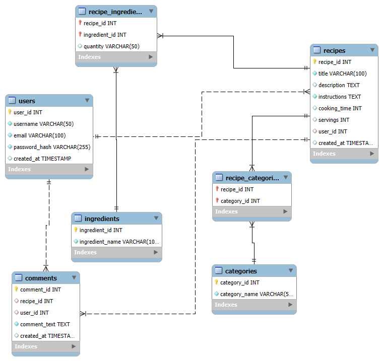

# RecipeCMS

[]()


RecipeCMS is a content management system database designed for managing recipes, users, ingredients, categories, and comments. It provides a structured way to store and organize recipe data, including user-generated content and interactions.

## Features

- **User Management**: Store user information including usernames, emails, and password hashes.
- **Recipe Storage**: Manage recipes with titles, descriptions, instructions, cooking times, servings, and creation timestamps.
- **Ingredient Tracking**: Maintain a list of ingredients and associate them with recipes via quantities.
- **Categorization**: Organize recipes into categories for easy browsing.
- **Comments System**: Allow users to comment on recipes.
- **Sample Data**: Includes sample data for testing and demonstration purposes.

## Database Schema

The database consists of the following tables:

- **Users**: Stores user account information.
- **Recipes**: Contains recipe details linked to users.
- **Ingredients**: A list of available ingredients.
- **Recipe_Ingredients**: Junction table linking recipes to ingredients with quantities.
- **Categories**: Defines recipe categories.
- **Recipe_Categories**: Junction table associating recipes with categories.
- **Comments**: Stores user comments on recipes.


## ER Diagram

For a visual representation of the database schema, refer to the `ER_Diagram.png` file, which illustrates the entity-relationship diagram.



## Setup Instructions

1. **Prerequisites**:
   - MySQL or a compatible SQL database server installed on your system.

2. **Database Creation**:
   - Run the `database.sql` file to create the RecipeCMS database and tables.
     ```sql
     -- Execute the contents of database.sql in your MySQL client
     ```

3. **Insert Sample Data** (Optional):
   - Run the `sample_data.sql` file to populate the database with sample data for testing.
     ```sql
     -- Execute the contents of sample_data.sql in your MySQL client
     ```

4. **Usage**:
   - Connect to the RecipeCMS database using your preferred MySQL client or application.
   - Use standard SQL queries to interact with the data.

## Technologies Used

- **MySQL**: Database management system for storing and retrieving data.

## Contributing

Feel free to contribute by submitting issues or pull requests. Ensure any changes align with the database schema.

## License

This project is open-source. Please refer to the license file if available.
